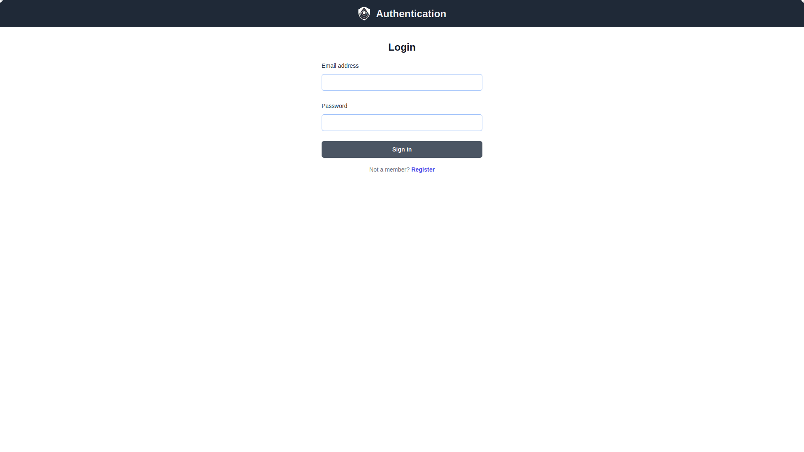

# NestJS NextJS Authentication Boilerplate

      
A full-stack authentication system built with NestJS (backend) and Next.js (frontend), featuring secure user authentication and authorization.

## Features

- 🔐 Secure JWT-based authentication
- 👤 User management system
- 🔄 TypeORM for database management
- 📝 API documentation with Swagger
- 🎨 Modern UI with Tailwind CSS
- ✨ Type-safe API calls using Orval

### Security

This application implements several security best practices:

- Password hashing using bcrypt
- JWT-based authentication
- TypeORM for SQL injection prevention
- Input validation using class-validator
- Secure HTTP-only cookies

## Screenshots




## Tech Stack

### Backend (RESTful API)

- NestJS Framework
- PostgreSQL with TypeORM
- Passport.js for authentication
- JWT for token management
- Class-validator for DTO validation
- Swagger for API documentation
- Orval for generated API hooks

### Frontend (App)

- Next.js Framework
- TailwindCSS for styling
- React Query for API interaction
- Zod for form validation
- React hook form for form handling

## Project Structure

auth-app/
├── apps/
│ ├── api/ # NestJS backend
│ └── app/ # Next.js frontend
└── common/
└── schema/ # Shared schemas

## Prerequisites

- [Node.js](https://nodejs.org)
- [PostgreSQL](https://postgresql.org)
- [Yarn package manager](https://yarnpkg.com)
- [TurboRepo](https://turbo.build)

## Getting Started

1. **Install dependencies**

   ```
   yarn install
   ```

2. **Set up environment variables**

   ```
   cp .env.example .env
   ```

3. **Start Application**
   ```
   yarn turbo dev
   ```
